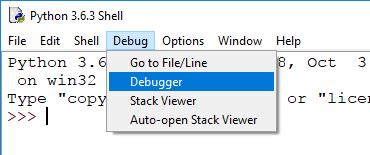
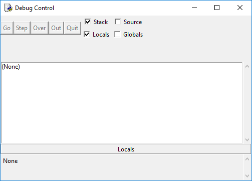

## Stepping

When you are running a program, you might want to know what the value of a certain variable is at a given point in the program. One way of finding this out is by printing the value of the variable.

Look at this program which divides `x` by `y` via subtraction:

```python
x = 25
y = 5
count = 0

# How many times does y go into x?
while x >= y:
    x = x - y
    count += 1
    #print(x)    # Check the current value of x

print(count)
```

If you wanted to check the value of `x` at any point inside the loop, you could add a `print` statement to display its value.

The drawbacks of this method are:
- You will have to remember to remove the `print` statement when you're confident your program works.
- The output of your `print` statement gets muddled up with the actual output you want.

Instead, you could use IDLE's built-in debug tools to step through the program line by line, and see the value of each variable at any point.

+ In an IDLE shell window, open the debugger:





+ Using IDLE, create a new file and paste in the code from above.

+ Run the code by pressing <kbd>F5</kbd>. The debugger will take over, and you can now press **Step** to step through the program one line at a time. You will see the line you are on in the box at the top, and the value of any variables at this point in time in the information box at the bottom.

Here is a run-through of the first run of the loop:


