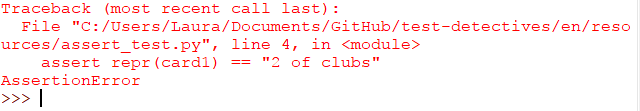

## Assert

According to the Cambridge Dictionary, the word **assert** means _"to say that something is certainly true"_. This meaning holds true when used in a programming context: you can test your code by asserting that a condition is true, and if it is not true, raise an error.

Let's look at some of the code from the [deck of cards](https://projects.raspberrypi.org/en/projects/deck-of-cards){:target="_blank"} project. If you do not have this code you can use the [starter code](resources/card.py) instead, but it would be useful to complete the Deck of cards project first so that you understand what the code does.

The `Card` class has an `__init__` method and a `__repr__` method.

```python
class Card:

    def __init__(self, suit, number):
        self._suit = suit
        self._number = number

    def __repr__(self):
        return self._number + " of " + self._suit
```

+ Create a new Python file and save it as `assert_test.py`. Make sure you save this file in the same directory as the `card.py` file from the Deck of cards project.

[[[rpi-gui-idle-opening]]]

Let's test that when we create a valid `Card` object, the representation of that object (`repr`) works correctly.

+ Inside your file, add the following code to allow you to access the `Card` class:

```python
from card import Card
```

+ Create a valid card - for this test it will be the 2 of hearts

```Python
card1 = Card("hearts", "2")
```

The `__repr__` method returns a string of the form `self._number + " of " + self._suit`. So if it is working correctly, we can expect "2 of hearts".

+ Add an assertion to your code

```Python
assert repr(card1) == "2 of hearts"
```

+ Save and run your test file. There should be no output at all because this assertion is True - the representation of the card object should be the 2 of hearts.

+ Change the code so that you are asserting the representation is something different:

```Python
assert repr(card1) == "2 of clubs"
```

This time you will see an **Assertion error** because the representation of the object you created is not "2 of clubs"



You can replace the condition in your assertion with **any statement** that should evaluate to True. For example, you could create another card and then assert that the two cards do not share the same number:

```Python
card2 = Card("hearts", "K")
assert card1.number != card2.number
```
