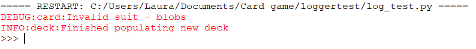

## Challenge: log detective

+ Download the [deck.py](resources/deck.py) file and add it to the same folder as your `card.py` and `log_test.py` files.

+ Add a logger to the `deck` file, setting its level to `DEBUG`.

+ Add a log `info()` statement which logs when the deck has been created.

+ Inside your `log_test.py` file, import the `Deck` class:

```python
from deck import Deck
```

+ Then, create a deck:

```python
deck = Deck()
```

+ Run the program and test whether you see information that the deck was created as well as the debug statement about you trying to assign an invalid suit.


