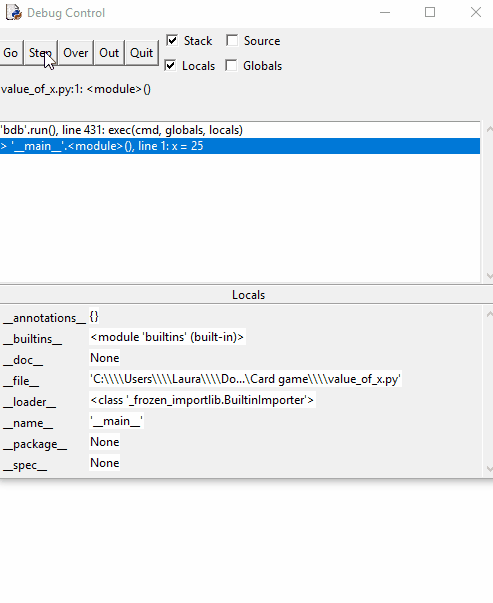

## स्टेपिंग(stepping)

जब आप एक प्रोग्राम(program) को चला रहे होते हैं, तो आप यह जानना चाहते होंगे कि प्रोग्राम में दिए गए एक निश्चित वेरिएबल(variable) का मूल्य क्या है। इसका पता लगाने का एक तरीका वेरिएबल के मूल्य को प्रिंट करके है।

इस कार्यक्रम को देखें जो घटाव के माध्यम से `x` को विभाजित करता है `y`से:

```python
x = 25
y = 5
count = 0

# How many times does y go into x?
while x >= y:
    x = x - y
    count += 1
    #print(x)    # Check the current value of x

print(count)
```

लूप के अंदर किसी भी समय अगर आपको `x` का मूल्य जानना है, तो आप उसका मूल्य प्रदर्शित करने के लिए `print` विवरण जोड़ सकते हैं।

इस विधि की कमियां हैं:
- जब आप विश्वासपात्र हैं की आपका प्रोग्राम काम करता है, तो आपको <`print` विवरण को हटाना याद रखना होगा।
- आपके `print` विवरण का आउटपुट(output) वास्तविक आउटपुट के साथ गड़बड़ होजाता है।

इसके बजाय, आप IDLE के अंतर्निहित डिबग टूल(debug tool) का उपयोग कर सकते हैं जो प्रोग्राम को प्रत्येक पंक्ति से गुजरते हुए और किसी भी समय हर एक वेरिएबल का मूल्य देख सकते हैं।

+ IDLE शेल विंडो(shell window) में, डिबगर(debugger) खोलें:


+ IDLE का उपयोग करके, एक नयी फ़ाइल बनाएँ और ऊपर वाले कोड को पेस्ट(paste) करें।

+ <kbd>F5</kbd> दबाकर कोड को (रन) Run करें। डिबगर संभाल लेगा, और अब आप **Step** दबाकर एक बार में एक पंक्ति करते हुए प्रोग्राम से गुजर सकते हैं। आपको सबसे ऊपर स्थित बॉक्स(box) में वर्तमान पंक्ति दिखेगी, और सबसे नीचे सूचना बॉक्स में प्रोग्राम के किसी भी वैरिएबल का मूल्य दिखाई देगा।

यहाँ लूप(loop) का पहला Run(रन) है:


