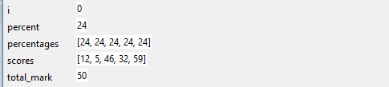

## चुनौती: स्टेप जासूस

+ इस प्रोग्राम की एक प्रति सहेजें(सेव(save) करें) जिसमे कुछ बग्स हैं:

### test_scores.py

```python
# Take a list of test scores and turn the scores
# into percentages before printing out the list

scores = [12, 5, 46, 32, 59]
total_mark = 50
percentages = []

i = 1

while i < 5:
    percent = round( (scores[i] / total_mark) * 100 )
    percentages.append( percent )

print(percentages)
```

+ प्रोग्राम को परखने के लिए अंतर्निहित डीबगर(debugger) का उपयोग करें और पता करें कि यह कहां गलत हुआ है।

+ कोई भी बग(bug) जो आपको मिले उन्हे ठीक करें।

--- hints --- --- hint ---

पहली बार जब आप डिबगर(debugger) Run(रन) करेंगे, तो आप देखेंगे की वेरिएबल `i` का मूल्य `1` के रूप में शुरू होता है, इसका मतलब है की पहला प्रतिशत जो काम किया है वो है `10%`।


यह अजीब है — `12/50` ये अंक के `10%` नहीं हैं। हालांकि, अगर हम `scores` सूची के अगले तत्व की जांच करते हैं, तो हम देख सकते हैं की अगले अंक हैं `5/50`, जो जी `10%` हैं।

क्योंकि यह सूची `0` से अनुक्रमित है, काउंटर(counter) को `1` की बजाय `0` पर शुरू करके इस बात(bug) को ठीक करें।

```python
counter = 0
```

--- /hint --- --- hint ---

अगर आप पहला बाग ठीक करेंगे, तो आप देख सकते हैं की पहले प्रतिशत की गणना `24%` की गयी है, जो की सही है। लेकिन, आगे बढ़ते रहें और आप देख सकते हैं की `percentages` सूची को `24` बार-बार जोड़ा जा रहा है। आप यह भी देख सकते हैं कि शेल के प्रोग्राम से कोई आउटपुट नहीं है।



ऐसा इसलिए है क्योंकि लूप अनंत है - हम लूप के अंदर कभी भी `i` का मूल्य नहीं बदलते हैं, इसलिए यह `scores` सूची में पहले तत्व के प्रतिशत का मूल्यांकन करता रहता है।

इसे ठीक करने के लिए लूप के अंदर `1` को `i` में जोड़ें:

```python
i += 1
```

--- /hint --- --- /hints ---
