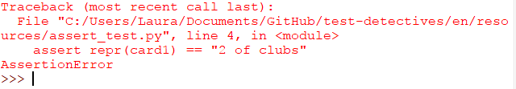

## दावे के साथ कहना

शब्दकोश के अनुसार, **assert** का मतलब है _"to say that something is certainly true"_। यह अर्थ एक प्रोग्रामिंग संदर्भ में सही है: आप अपने कोड की जाँच यह दावा करके कह सकते हैं कि एक शर्त सही है, और यदि यह सही नहीं है, तो एक दोष लिख लें। Python(पाइथन) में, आप इसे एक अंतर्निहित कमांड `assert` का उपयोग करके कर सकते है।

आइये [_Deck of cards_](https://projects.raspberrypi.org/en/projects/deck-of-cards){:target="_blank"} प्रोजेक्ट(project) में से कुछ कोड को देखते हैं। अगर आपके पास यह कोड नहीं है, आप इसकी बजाय [`card.py` starter code](resources/card.py) का उपयोग कर सकते हैं, लेकिन यह सबसे अच्छा होगा की यदि आपने Deck of cards(डेक ऑफ काडॆ) प्रोजेक्ट पहले खत्म किया है ताकि आप समझते हैं की कोड क्या करता है।

`Card` क्लास में एक `init` मेथड और एक `repr` है:

```python
class Card:

    def __init__(self, suit, number):
        self._suit = suit
        self._number = number

    def __repr__(self):
        return self._number + " of " + self._suit
```

+ एक नयी Python फ़ाइल तयार करें और उसे `assert_test.py` के नाम से सहेजें। सुनिश्चित करें की आप इस फ़ाइल को उसी डाइरैक्टरि (directory) में सहेजते हैं जहां _Deck of cards_ प्रोजेक्ट की `card.py` फ़ाइल है।

[[[rpi-gui-idle-opening]]]

आइये परीक्षण करते हैं की जब हम एक जायज़ `Card` ऑब्जेक्ट(object) तयार करते हैं, क्या उस ऑब्जेक्ट का रेप्रेसेंटेशन (representation) मेथड (`repr`) सही काम करता है।

+ `assert_test.py` में, आपको `Card` क्लास के प्रवेश की अनुमति मिलने के लिए निम्न कोड जोड़ें।

```python
from card import Card
```

+ एक जायज़ कार्ड तयार करें — इसकी जाँच करने के लिए यह पान की 2 (दुक्की) होगी:

```python
card1 = Card("hearts", "2")
```

`self._number + " of " + self._suit` के रूप में `repr` मेथड(method) एक स्ट्रिंग(string) देता है, इसलिए अगर याग ठीक से काम कर रहा है तो हम ये उम्मीद करते हैं की वह `"2 of hearts"` दे।

+ अपने कोड को एक दावा जोड़ें जो बताएगा की आपको लगता है आपके `card1` का `repr` ऑब्जेक्ट(object) `"2 of hearts"` के बराबर होना चाहिए:

```python
assert repr(card1) == "2 of hearts"
```

+ आपकी परीक्षण फ़ाइल को सहेजें और Run(रन) करें। क्योंकि यह दावा `True` है, कोई आउटपुट(output) नहीं होना चाहिए — कार्ड ऑब्जेक्ट का प्रतिनिधित्व `"2 of hearts"` होना चाहिए, क्योंकि वही सूट(suit) और संख्या आपने ऑब्जेक्ट बनाने के लिए उपयोग की थी।

+ कोड को बदल दें ताकि आपके प्रतिनिधित्व का दावा कुछ अलग है:

```python
assert repr(card1) == "2 of clubs"
```

इस बार आपको एक **AssertionError** दिखाई देगा, क्योंकि `card` ऑब्जेक्ट का प्रतिनिधित्व `"2 of clubs"` (चिड़ी की दुक्की) नहीं है।



आप अपने दावे में शर्त को **any statement** जिसका सच के रूप में मूल्यांकन हो उससे बदल सकते हैं। उदाहरण के लिए, आप दूसरा कार्ड बना सकते हैं और फिर दावा कर सकते हैं कि दोनों कार्ड एक ही संख्या साझा नहीं करते हैं:

```Python
card2 = Card("hearts", "K")
assert card1.number != card2.number
```

--- collapse ---
---
शीर्षक: दावों का क्या मतलब है?
---

जब भी आप एक कार्यशील प्रोग्राम को अपडेट करते हैं, तो संभावना है कि आप एक त्रुटि को दाखिल करते हैं। यदि आप दावे की परीक्षण फ़ाइल बनाए रखते हैं जो प्रोग्राम के लिए `True` है, तब जब भी आप प्रोग्राम को अपडेट(update) करते हैं यह देखने के लिए कि क्या आपके परिवर्तन किसी भी दावे को तोड़ते हैं तो आप परीक्षण फ़ाइल को Run कर सकते हैं। अगर एक `AssertionError` होता है, तब आपको पता होता है की आपने एक बग दाखिल किया है, और आपको पता है उसे कहां ठीक करना है।

--- /collapse ---
