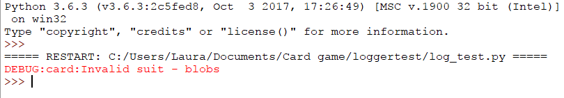

## लॉगिंग

आइए सूट प्रॉपर्टी के लिए `Card` क्लास(class)‌ कोड(code): सेटर मेथड के एक और हिस्से को देखें।

```python
@suit.setter
def suit(self, suit):
       if suit in ["hearts", "clubs", "diamonds", "spades"]:
           self._suit = suit
       else:
           print("That's not a suit!")
```

यदि उपयोगकर्ता एक सूट सेट करने की कोशिश करता है जो सूची में नहीं है, तो फिलहाल के लिए कोड `"That's not a suit"` प्रिंट करेगा। अगर हम इस क्लास को एक सचमुच के कार्ड गेम में उपयोग करते हैं, तो जब किसी सूट को कुछ अनेपेक्षित सोंपा जा रहा है तो वह सूचित करने में मददगार होगा। हालाँकि, हम जरूरी रूप से नहीं चाहेंगे कि खिलाड़ी को भी सूचित किया जाए।

दोष रिपोर्ट करने के लिए `print` फंकशन को इस्तेमाल करने की बजाय हम उसे लॉग कर सकते हैं।

+ `card.py` फ़ाइल खोलें जो आपने लिखी या डाउन्लोड की थी, जिसमें `Card` क्लास का कोड है।

+ `logging` मॉड्यूल को आयात करने के लिए फ़ाइल के शीर्ष पर एक कोड की पंक्ति जोड़ें। यह एक मानक Python(पाइथन) मॉड्यूल(module) है, इसलिए आपको कुछ भी अतिरिक्त इंस्टॉल(install) करने की जरूरत नहीं होगी।

```python
import logging
```

+ उसके नीचे, अपना लोगर सेट करें। पहली पंक्ति लोगर बनाती है, और जिस फ़ाइल में समस्या हुई है उसे `__name__` लॉग करती है। दूसरी पंक्ति यह निर्धारित करती है कि आप कितनी जानकारी देखना चाहते हैं: `DEBUG` सूचना का सबसे विस्तृत स्तर है। हम अगले चरण में इन सेटिंग्स(settings) के स्तर पर अगले कदम में चर्चा करेंगे।

```Python
logger = logging.getLogger(__name__)
logger.setLevel(level=logging.DEBUG)
```

+ `print` विवरण को उस विवरण से बदलें जो डीबग(debug) जानकारी को लॉग करता है।

```python
logger.debug("Invalid suit - " + str(suit) )
```

आगे, आइये जाँच करें की जब आप प्रोग्राम Run करते हैं और एक अमान्य सूट सेट करते हैं तो कैसा दिखता है।

+ एक नई फ़ाइल बनाएं और `log_test.py` के रूप में सहेजें उसी फ़ोल्डर में जहां आपका `card.py` कोड है।

+ `log_test` फ़ाइल में, `Card` क्लास और `logging` मॉड्यूल आयात करने के लिए कुछ कोड जोड़ें:

```Python
from card import Card
import logging
```

+ आप संदेश के कौनसे निम्नतम स्तर को देखना चाहते हैं यह निर्दिष्ट करने के लिए कोड की एक पंक्ति जोड़ें। इस मामले में, हम डिबग संदेश देखना चाहेंगे।

```python
logging.basicConfig(level=logging.DEBUG)
```

+ अब एक कार्ड तयार करें और एक अमान्य सूट सेट करने का प्रयास करें:

```python
my_card = Card("hearts", "6")
my_card.suit = "blobs"
```

+ कोड Run(रन) करें और आपको एक डीबग संदेश दिखाई देगा:



ध्यान दें कि प्रदान की गई जानकारी आपको उस फ़ाइल के बारे में भी बताती है जहाँ लॉग की गयी समस्या है: `card`, मतलब `card.py`।

+ अधिक विस्तृत जानकारी जोड़कर आप अपने लॉगिंग(logging) संदेशों में सुधार कर सकते हैं, उदाहरण के लिए:

```python
logger.debug("Tried to set an invalid suit (" + str(suit) + ") for " + repr(self) )
```
