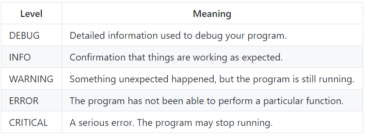

## लॉग(log) करना है या नहीं करना है

लॉगिंग का एक उपयोगी पहलू यह है कि आप लॉग किए गए संदेशों के विस्तार का स्तर बदल सकते हैं। ये संभव स्तर हैं, जो सबसे अधिक विस्तार से लेकर कम से कम हैं:



_[Python Logging How-To](https://docs.python.org/3.6/howto/logging.html#logging-advanced-tutorial){:target="_blank"} से जानकारी_

`logger.debug()` का उपयोग करने की बजाय, आप अन्य विवरण स्तरों के साथ संदेश लॉग कर सकते हैं: `logger.info()`, `logger.warning()`, `logger.error()`, या `logger.critical()`।

अपने प्रोग्राम को डीबग करते समय सबसे अधिक जानकारी प्राप्त करने के लिए, आप लोगर का स्तर `DEBUG` पर सेट करना चाहेंगे। हालांकि, एक बार जब आपका प्रोग्राम समाप्त हुआ है और काम कर रहा है, तो आप शायद अब इतनी जानकारी नहीं देखना चाहते हैं। आइए एक उदाहरण देखें।

+ `card.py` में लोगर का स्तर `CRITICAL` को बदलें:

```python
logger.setLevel(level=logging.CRITICAL)
```

+ फिर से ` log_test.py ` कार्यक्रम को Run(रन) करें। अब आप कोई लॉग संदेश नहीं देखेंगे, क्योंकि आपने केवल सबसे महत्वपूर्ण (आलोचनावादी) संदेश देखने के लिए कहा है। चूँकि आपने कोई `logger.critical()` संदेश आपके प्रोग्राम में नहीं जोड़े थे, इसलिए यह कुछ भी नहीं दिखाएगा।

+ अपने लॉगिंग स्तर को वापस `DEBUG` में बदलें ।
