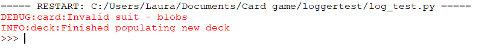

## चुनौती: लॉग जासूस

+ [`deck.py`](resources/deck.py) फ़ाइल(file) डाउन्लोड(download) करें और इसे अपने उसी फ़ोल्डर(folder) में जोड़ें जहां `card.py` और `log_test.py` फाइलें हैं।

+ `DEBUG` स्तर का एक लोगर `deck.py` फ़ाइल को जोड़ें।

+ जब भी एक डेक ऑब्जेक्ट(object) बनाया जाता है, रेकॉर्ड करने के लिए एक लॉग `info()` विवरण जोड़ें।

+ आपके `log_test.py` फ़ाइल के अंदर `Deck` क्लास(class) आयात करें:

```python
from deck import Deck
```

+ फिर, एक डेक(deck) ऑब्जेक्ट(object) बनाएं:

```python
deck = Deck()
```

+ प्रोग्राम Run(रन) करें। अब आपको जानकारी दिखनी चाहिए कि अमान्य सूट(suit) के बारे में डीबग विवरण (debug statement) के अतिरिक्त डेक भी बनाया गया है।


