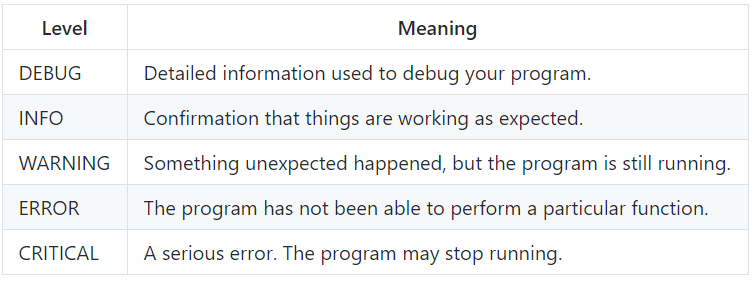

## To log or not to log

One useful aspect of logging is that you can change the level of detail of the logged messages. These are the possible levels, going from most detail to least:



_Information from [Python Logging How-To](https://docs.python.org/3.6/howto/logging.html#logging-advanced-tutorial){:target="_blank"}_

So instead of using `logger.debug()`, you can log messages with other detail levels: `logger.info()`, `logger.warning()`, `logger.error()`, or `logger.critical()`.

To get the most information while you're debugging your program, you'll want to set the level of the logger to `DEBUG`. However, once your program is finished and working, you probably don't want to see so much information anymore. Let's look at an example.

+ In `card.py`, change the level of the logger to `CRITICAL`:

```python
logger.setLevel(level=logging.CRITICAL)
```

+ Run the `log_test.py` program again. You will no longer see any log messages, because you have asked to only see the most important (critical) messages. Since you didn't add any `logger.critical()` messages to your program, it won't show anything.

+ Change your logging level back to `DEBUG`.
