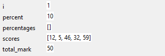
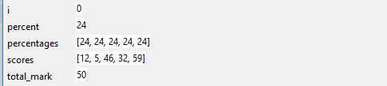

## Challenge: step detective

+ Save a copy of this program which contains some bugs:

### test_scores.py

```python
# Take a list of test scores and turn the scores
# into percentages before printing out the list

scores = [12, 5, 46, 32, 59]
total_mark = 50
percentages = []

i = 1

while i < 5:
    percent = round( (scores[i] / total_mark) * 100 )
    percentages.append( percent )

print(percentages)


```

+ Use the built-in debugger to step through the program and find out where it goes wrong.

+ Fix any bugs you find.

--- hints --- --- hint --- The first time you run the debugger, you will notice that the value of the variable `i` begins as `1`, meaning that the first percentage worked out is `10%`.



This seems odd — `12/50` is not `10%` of the marks. However, if we examine the next element in the `scores` list, we can see that the next mark is `5/50`, which is `10%`.

Fix this bug by beginning the counter at `0` rather than `1`, since the list is indexed from `0`.

```python
counter = 0
```

--- /hint --- --- hint --- If you fix the first bug, you will see that the first percentage calculated is `24%`, which is correct. However, keep stepping and you will see that `24` is repeatedly added to the `percentages` list. You may also notice that there is no output from the program in the shell.



This is because the loop is infinite — we never change the value of `i` inside the loop, so it keeps evaluating the percentage for the first element in the `scores` list.

Fix this by adding `1` to `i` inside the loop:

```python
i += 1
```

--- /hint --- --- /hints ---
